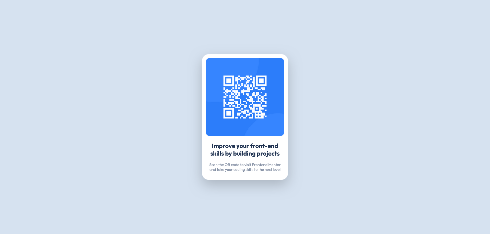

# Frontend Mentor - QR code component solution

This is a solution to the [QR code component challenge on Frontend Mentor](https://www.frontendmentor.io/challenges/qr-code-component-iux_sIO_H). 
## Table of contents

- [Overview](#overview)
  - [Screenshot](#screenshot)
  - [Links](#links)
- [My process](#my-process)
  - [Built with](#built-with)

## Overview

### Screenshot

### Links

- Solution URL: [URL](https://github.com/angielle/qr-code-component)
- Live Site URL: [URL](https://angielle.github.io/qr-code-component/)

## My process

### Built with

- Semantic HTML5 markup
- CSS custom properties

## Author

- Website - [Dannah](https://www.github.com/angielle)
- Frontend Mentor - [@angielle](https://www.frontendmentor.io/profile/angielle)
